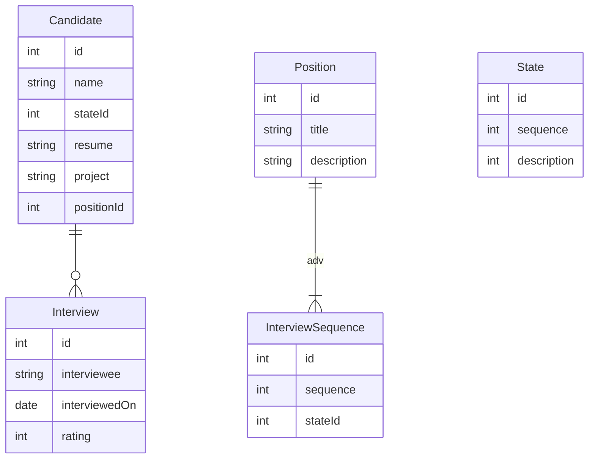

The Hiring proect is to help keep track of candidates state in the hiring process.

## State
* Applied
* Initial Email Sent
* Scheduled Initial Call
* Waiting for Project
* Reviewing Project
* Scheduling Interview
* Tecnical Interview Scheduled
* Team Interview Scheduled
* Final Interview
* Extend Offer
* Accepted
* Declined
* Other Offer
* Didn't Reply or Show

## Rating
1 - Strong No
2 - Weak No
3 - Meh
4 - Weak Yes
5 - Strong Yes